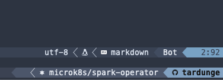

# tmux-gh
Tmux plugin to fetch the github profile. Displays, the currently authenticated git username.



# Features
- Adds github username to the status line.

# Installation

If you are using `gh` cli to manage your github.com or affliated github accounts and switch between them, then this plugin shows the currently active account in the tmux status line.

## Requirements

- [`gh`](https://cli.github.com/)

**Note:** Please use this command to check whether tmux is able to find `gh`: `tmux run-shell -b 'command -v gh && echo "gh is available" || echo "gh is not available"'`

## Install via [TPM](https://github.com/tmux-plugins/tpm/)

Add this line to your `~/.tmux.conf`

```tmux
set -g @plugin 'tardunge/tmux-gh'
```

Reload configuration, then press `prefix` + `I` to install plugin.

# Usage

For rendering the current active gh account:
```tmux
# in .tmux.conf
set-option -g status-right '#{tmux_gh_uname}'

# incase you are using powerlevel10k theme.
# set your desired area with the place-holder #{tmux_gh_uname}

set-option -g @themepack-status-right-area-right-format "#{tmux_gh_uname}"
```

# Customization

Here are available options with their default values:

```tmux
# in .tmux.conf
set-option -g @tmux_gh_icon "" # defaults to "Github:"
set-option -g @tmux_gh_default_uname "tardunge" # defaults to "tmux-gh-uname"
```

# License

[MIT](https://github.com/tardunge/tmux-gh/blob/main/LICENSE)
